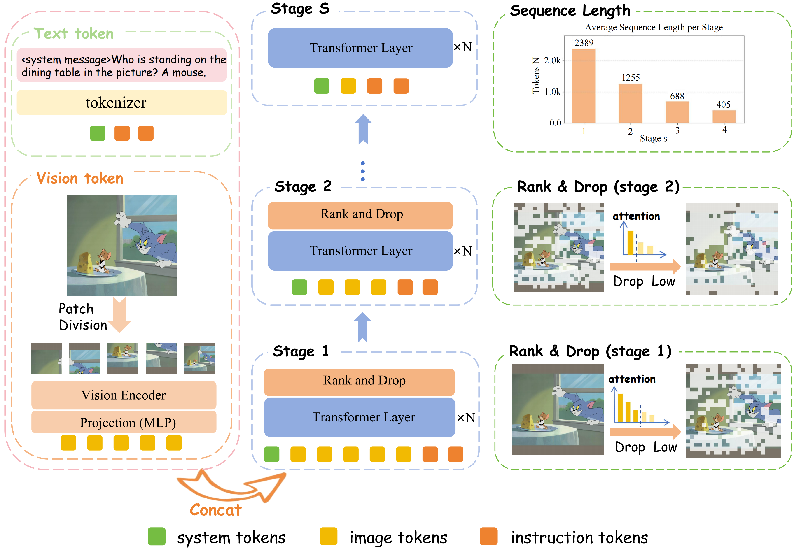

# PyramidDrop: Accelerating Your Large Vision-Language Models via Pyramid Visual Redundancy Reduction
<p align="center">
     <br>
</p>

## 🎯 News

**[2024.10.18]** 🚀 We release the paper at [ArXiv]()

## 💡 Highlights
- 🔥 **Increasing Redundancy**: We find that redundancy of
image tokens is relatively minimal in the shallow layers and becomes progressively larger in deeper
layers. 
- 🔥 **Efficient Training**: PyramidDrop can achieve a 40% training time and 55% inference FLOPs acceleration of LLaVA-NeXT with comparable performance.
- 🔥 **Efficient Inference**: PyramidDrop
could also serve as a plug-and-play strategy for inference acceleration without
training, with better performance and lower inference cost than counterparts.
- 🔥 **High Compatibility**:
Our codebase support flash_attention_2, sdpa and eager attention pattern, and it can be easily migrated to different versions of Transformers.


## 👨‍💻 Todo

- [x] Release the PDrop evaluation and training code of llava1.5
- [x] Release the PDrop evaluation and training code of llava-next
- [x] Support kv cache 
- [ ] Release the checkpoints 

## 🔧 Install

1. Clone this repository and navigate to PyramidDrop folder
```bash
git clone https://github.com/Cooperx521/PyramidDrop.git
cd PyramidDrop
```

2. Install Package
```Shell
conda create -n pdrop python=3.10 -y
conda activate pdrop
pip install --upgrade pip  # enable PEP 660 support
pip install -e .
```

3. Install additional packages for training
```
pip install -e ".[train]"
pip install flash-attn --no-build-isolation
```
## ⭐️ Quick Start
<a name="core-implementation"></a>
### 1. Core Implementation
The main implementation of PyramidDrop is in ``` llava/model/modeling_llama_pdrop.py```. The efficient forward process of LLM with PyramidDrop is in function [pdrop_forward](https://github.com/Cooperx521/PyramidDrop/blob/16a233fee921aedad8de01529d9d2c9781af2eac/llava/model/modeling_llama_pdrop.py#L1106), and Rank & Drop is implemented in function [pdrop_rank_drop](https://github.com/Cooperx521/PyramidDrop/blob/16a233fee921aedad8de01529d9d2c9781af2eac/llava/model/modeling_llama_pdrop.py#L1291). 
To prepare for PyramidDrop, the function [prepare_inputs_labels_for_multimodal_pdrop](https://github.com/Cooperx521/PyramidDrop/blob/16a233fee921aedad8de01529d9d2c9781af2eac/llava/model/llava_arch.py#L472-L474) collects the following parameters: the length of the text, the image placeholder position, and the number of image tokens.  The length of the text is used only during inference to determine the position of the last instruction token.
The entire multimodal forward process is encapsulated within the [LlavaLlamaForCausalLM_PDrop](https://github.com/Cooperx521/PyramidDrop/blob/16a233fee921aedad8de01529d9d2c9781af2eac/llava/model/language_model/llava_llama_pdrop.py#L159) class.
### 2. Compatibility
The current code implementation is based on ```transformers-4.37.2```. If you want to run it on other versions of transformers, you only need to find modeling_llama.py and make some simple modifications. This includes adjusting the [pdrop_forward](https://github.com/Cooperx521/PyramidDrop/blob/16a233fee921aedad8de01529d9d2c9781af2eac/llava/model/modeling_llama_pdrop.py#L1106) and [pdrop_rank_drop](https://github.com/Cooperx521/PyramidDrop/blob/16a233fee921aedad8de01529d9d2c9781af2eac/llava/model/modeling_llama_pdrop.py#L1291) functions according to the specific transformer version.

If you want to use PyramidDrop on your own model, and if the LLM is based on llama, you can directly add these functions based on [Core Implementation](#core-implementation) to run it easily. If the LLM is not based on llama, you will need to adjust these functions according to the forward function of your LLM.


## Efficient Training
We can use PyramidDrop during the training process of [LLaVA](https://github.com/haotian-liu/LLaVA) and [Open-LLaVA-NeXT](https://github.com/xiaoachen98/Open-LLaVA-NeXT).
Firstly, please prepare the data of pretraining and finetuning following the instructions of the two repositories above.
Then you can directly use PyramidDrop to reduce training cost, code can be found in ```scripts/v1_5/pdrop_train``` and ```scripts/v1_6/pdrop_train```.

Options to note:

- `--layer_list  '[8,16,24]' `: the layers after which we apply rank & drop.
- `--image_token_ratio_list "[0.5,0.25,0.125]" `: denote the image tokens ratio we retain at different stage, and this represents we obtain 50%, 25%, 12.5% after layer8, layer16, layer24. In this case, we have divided the forward pass into 4 stages, and λ = 0.5.

## Efficient Inference

We follow the original evaluation in [LLaVA](https://github.com/haotian-liu/LLaVA) for most of benchmarks. For MMStar, DocVQA, InfoVQA, ChartQA
OCRVQA we use [VLMEvalKit](https://github.com/open-compass/VLMEvalKit). 

See [Evaluation.md](https://github.com/haotian-liu/LLaVA/blob/main/docs/Evaluation.md) to prepare for inference. 

If you want to use PyramidDrop to operate efficient inference on original llava1.5 and llava-next, evaluation code can be found in ```scripts/v1_5/pdrop_eval``` and ```scripts/v1_6/pdrop_eval```.


## ❤️ Acknowledgments

- [LLaVA](https://github.com/haotian-liu/LLaVA): the codebase we built upon. Thanks for their brilliant contributions to the community.
- [Open-LLaVA-NeXT](https://github.com/xiaoachen98/Open-LLaVA-NeXT): Thanks for the impressive open-source implementation of LLaVA-NeXT series.
- [VLMEvalKit](https://github.com/open-compass/VLMEvalKit): the amazing open-sourced suit for evaluating various LMMs!